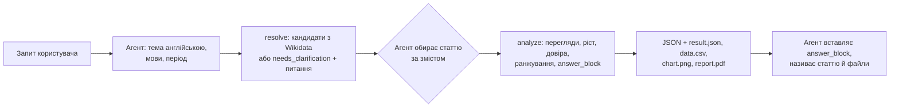

# wikipedia-demand-signals

Навичка для AI-агента у форматі [Agent Skills](https://agentskills.io/specification). Вона бере перегляди статей Wikipedia і показує, чи росте інтерес до теми в різних мовних розділах, де він сильніший і наскільки цьому можна довіряти. Так команда B2C-продукту може обрати, яку тему розвивати далі і які мови перевіряти для запуску. Результат — коротка відповідь у чаті, графік і PDF на одну сторінку, яким можна поділитися. Усі числа й висновки рахує Python-код навички, а агент лише обирає статтю й переказує результат, тому навичка працює на швидкій дешевій моделі (перевірено на Claude Haiku 4.5).

## Коротко: три приклади із завдання

| Запит | Що робить навичка | Результат (справжній вивід, 2024-09 – 2026-08) |
|---|---|---|
| Інтервальне голодування в pl і cs за два роки | у польській Wikipedia статті немає під жодною назвою → `no_article` як знахідка; аналізує cs; ширше «fasting» лише *пропонує* | cs: частка статті в трафіку розділу −47,0 % рік до року, довіра низька (медіана 232 перегляди на місяць, менше за 300); у pl інтерес цим способом не виміряти |
| Курс астрономії: чи росте інтерес в uk і наскільки цьому довіряти | бере статтю «Астрономія» (Q333) без зайвих питань | не росте: −46,4 % рік до року, довіра висока — 10 з 12 місяців нижчі, ніж рік тому ([розбір нижче](#приклад-запит-2-із-завдання)) |
| Вивчення англійської «у вибраних нами розділах» + звіт | одне уточнення з готовим набором мов; статті про вивчення англійської як іноземної в pl, cs, uk немає → бере «Англістику» (Q27968) і прямо називає її проксі; робить PDF | pl → cs → uk, усі спадають (−15,1 / −22,9 / −29,9 %), довіра низька в усіх: медіана 244 / 44 / 20 переглядів на місяць |

Хід прикладу 3 (уточнення, вибір проксі, PDF) — з прогону на Haiku, числа — з виводу скрипта.

## Швидкий старт

Потрібні Python 3.11+ і доступ до API Wikimedia. Рекомендовано [uv](https://docs.astral.sh/uv/): він сам ставить залежності (`numpy`, `matplotlib`) із заголовка скрипта (PEP 723) і нічого не створює в репозиторії.

**Встановити в Claude Code.** Навичку можна покласти в папку проєкту (`.claude/skills/`, діє лише в ньому) або в особисту (`~/.claude/skills/`, діє в усіх проєктах).

Через [skills CLI](https://github.com/vercel-labs/skills) (потрібен Node.js), з кореня проєкту. Команда однакова в bash, PowerShell і cmd; куди ставити, вона спитає сама, а з `-g` одразу ставить в особисту папку:

```bash
npx skills add cookiefbi/wikipedia-demand-signals -a claude-code
```

Або без Node.js, через `git clone` (корінь репозиторію — це і є папка навички). У проєкт, з його кореня, однаково в усіх оболонках:

```bash
git clone https://github.com/cookiefbi/wikipedia-demand-signals.git .claude/skills/wikipedia-demand-signals
```

В особисту папку (bash і PowerShell; у cmd замість `$HOME` пишіть `%USERPROFILE%`):

```bash
git clone https://github.com/cookiefbi/wikipedia-demand-signals.git "$HOME/.claude/skills/wikipedia-demand-signals"
```

**Запитати.** Найнадійніше — викликати навичку через `/` ([чому](#багато-навичок-і-дозволи)):

```text
/wikipedia-demand-signals Чи зростає інтерес до астрономії в україномовній Wikipedia і наскільки цьому можна довіряти?
```

**Без агента** — ті самі дві команди, які запускає агент. Тут вони для навички в проєкті й запускаються з його кореня; для особистої папки замініть `.claude/skills/wikipedia-demand-signals` на повний шлях до неї. Результати з'являються в `./wds-output/`:

```bash
uv run .claude/skills/wikipedia-demand-signals/scripts/wds.py resolve "astronomy" --langs uk
uv run .claude/skills/wikipedia-demand-signals/scripts/wds.py analyze --qid Q333 --langs uk --answer-lang uk --report
```

Якщо uv встановлено через pip і його немає в PATH, пишіть `python -m uv run …`. Без uv (версії в `requirements.txt` зафіксовані й збігаються із заголовком скрипта, це перевіряє тест):

```bash
python -m pip install -r .claude/skills/wikipedia-demand-signals/requirements.txt
python .claude/skills/wikipedia-demand-signals/scripts/wds.py analyze --qid Q333 --langs uk --report
```

Тести працюють без мережі, на записаних відповідях API (запускати з папки навички):

```bash
uv run --no-project --with-requirements requirements-dev.txt pytest tests/
```

## Як це працює

**Код рахує, агент переказує.** Дешева модель легко додає висновки, яких немає в даних (це видно в прогонах на Haiku), а число, яке порахувала модель, користувач не перевірить. Тому все, що можна перевірити, робить код: пошук статті, завантаження, очищення рядів, метрики, тренд, довіру, ранжування і навіть ключові речення відповіді. Агентові лишається те, чого код знати не може: зрозуміти запит, обрати статтю, що відповідає змісту питання, і переказати результат мовою користувача.



### Приклад: запит 2 із завдання

> Ми думаємо додати курс з астрономії до освітнього застосунку. Чи зростає інтерес до цієї теми в україномовній Wikipedia, і наскільки цьому зростанню можна довіряти?

Нижче справжній вивід скрипта (запуск 26.09.2026), скорочений на `…`.

**Крок 1.** Агент перекладає тему англійською і шукає кандидатів:

```bash
uv run ".../scripts/wds.py" resolve "astronomy" --langs uk
```

```json
{"status": "ok", "query": "astronomy", "langs": ["uk"], "ambiguous": false,
 "candidates": [
  {"qid": "Q333", "label": "astronomy", "description": "natural science studying celestial objects and phenomena in the cosmos",
   "sitelinks": {"uk": "Астрономія"}, "sitelinks_total": 252, "found_via": "both"},
  {"qid": "Q3232273", "label": "Astronomy", "description": "American magazine", "sitelinks": {"uk": null}, "…": "…"},
  {"qid": "Q12012641", "label": "astronomy", "description": "fictional class at Hogwarts", "sitelinks": {"uk": null}, "…": "…"},
  "…"]}
```

`ambiguous: false`, тож агент не перепитує: бере першого кандидата, чий опис відповідає питанню (наука, а не журнал).

**Крок 2.** Аналіз зі звітом українською:

```bash
uv run ".../scripts/wds.py" analyze --qid Q333 --langs uk --period 24m --answer-lang uk --report
```

```json
{"status": "ok", "period": {"from": "2024-09", "to": "2026-08", "months": 24},
 "answer_block": "- uk: спадає, перегляди на мільйон -46,4 % рік до року.\n- uk: висока довіра — перевірки пройдено.\n- …",
 "must_say": [
  "uk: спадає, перегляди на мільйон -46,4 % рік до року.",
  "uk: висока довіра — перевірки пройдено.",
  "Мовний розділ — не країна (його читачі живуть у багатьох країнах), а інтерес — не готовність платити: перегляди показують цікавість, а не попит на продукт.",
  "З 2025-03-20 Вікімедіа фільтрує ботів суворіше, а раніші дані не перераховано, тож порівняння через цю дату частково відображає зміну правил."],
 "assumptions": ["uk: topic measured by article 'Астрономія' (+1 redirect)",
  "growth = last 12 months (2025-09..2026-08) vs the 12 before (2024-09..2025-08)", "…"],
 "results": [
  {"qid": "Q333", "lang": "uk", "status": "ok", "title": "Астрономія",
   "views_last_12m": 6712, "views_prev_12m": 16614, "growth_pct": -59.6,
   "per_million_last_12m": 9.89, "per_million_growth_pct": -46.4,
   "trend": "falling", "confidence": "high",
   "reasons": ["views per million edition views -46.4% year over year (-10% or less counts as falling)",
    "steady: 10 of 12 months are below the same month a year earlier (typical month -47.2%)",
    "checks passed: at least 300 views a month, 24+ months of history, no one-off spikes or data warnings, absolute and per-million growth agree"],
   "warnings": []}],
 "ranking": {"by": "growth", "order": [{"lang": "uk", "why": "views per million -46.4% year over year, high confidence"}]},
 "caveats": ["language edition ≠ country: …", "interest ≠ willingness to pay: …", "…"],
 "files": {"result_json": "…", "data_csv": "…", "chart_png": "…", "report_pdf": "…"}}
```

**Крок 3.** Агент відповідає за шаблоном зі SKILL.md: `answer_block` (пункти `must_say` одним текстом) дослівно, яка стаття представляє тему, шляхи до PDF і графіка, що можна зробити далі.

По суті відповідь на питання — ні, інтерес не росте. Частка статті в трафіку українського розділу за рік упала на 46,4 %, і довіра висока: 10 з 12 місяців нижчі, ніж рік тому. Абсолютні перегляди впали ще більше (−59,6 %), зокрема тому, що за 2024–2026 роки весь український розділ зменшився приблизно з 80 до 50 млн людських переглядів на місяць. Вересневий пік 2024 року (4 687 переглядів) — шкільний сезон, а не разовий сплеск, бо у вересні 2025 теж пік.

Файли лягають у `wds-output/astronomy_uk_24m/`: `result.json` (той самий JSON), `data.csv` (помісячно; стаття й редиректи окремими колонками, тож кожне число можна перерахувати), `chart.png` і `report.pdf` — A4 на одну сторінку з таблицею, графіком, висновками й причинами, застереженнями, допущеннями та джерелами.

### Структура

| Шлях | Що там |
|---|---|
| `SKILL.md` | інструкція для агента (англійською): коли вмикатися, дві команди, як обрати статтю, що сказати користувачу |
| `scripts/wds.py` | CLI: лише аргументи й вивід |
| `scripts/wds_lib/` | уся логіка: `api` (HTTP, кеш, ліміти), `resolve`, `pageviews`, `series`, `stats`, `verdict`, `analyze`, `report`, `i18n` |
| `tests/` | тести: синтетичні ряди й записані відповіді API |
| [`docs/SPEC.md`](docs/SPEC.md) | усі рішення з поясненням, чому саме так |
| [`docs/verification.md`](docs/verification.md) | звірка з pageviews.wmcloud.org і перевірка в PowerShell |
| [`evals/results/`](evals/results/) | прогони на Haiku |

## Як навичка оцінює результати й перевіряє висновки

**Частка розділу, рік до року.** Абсолютні перегляди вводять в оману: весь український розділ за 2024–2026 роки впав приблизно з 80 до 50 млн людських переглядів на місяць. Тому головна метрика — перегляди на мільйон переглядів усього розділу (`per_million_*`). Вона прибирає і розмір розділу, і загальні зміни трафіку Wikipedia. Ріст завжди рахується «рік до року»: останні 12 місяців проти попередніх 12, тож сезонність не заважає. Абсолютні числа теж є в JSON, а якщо вони змінилися в інший бік, ніж частка, `reasons` каже про це прямо.

**Тренд визначає одне правило:** ріст частки ≥ +10 % — `rising`, ≤ −10 % — `falling`, між ними — `flat`. Якщо ріст порахувати не можна, тренд — `insufficient_data`. Решта статистики впливає лише на довіру.

**Довіра — перелік перевірок, а не зважений бал:**

| Перевірка | Навіщо | На реальних даних |
|---|---|---|
| медіана ≥ 300 переглядів на місяць | на малій базі відсотки — здебільшого шум | cs «Přerušovaný půst»: 232 → low |
| ≥ 24 місяці історії | ріст «з нуля» не рахується (`growth_pct: null`) | cs «Pickleball», створена 2026-05-06 → `insufficient_data` |
| стійкість: щонайменше 10 з 12 місяців змінилися в той самий бік, що й рік тому (сезонний Mann-Kendall) | звичайний Mann-Kendall бачить «тренд» у шкільній сезонності: у 89 % синтетичних рівних рядів проти 5 % у сезонного | uk «Астрономія»: 10 з 12 нижчі → high |
| немає разових сплесків: місяць у 2,5 раза вищий за сусідні, а в тому ж місяці сусіднього року такого піку немає | сплеск сам може перевести ріст через поріг 10 % | pl «Astronomia» 2025-11 (2,8×) — сплеск; вересень у uk «Астрономія» — сезон |
| немає попереджень про дані: різка зміна рівня (3×), понад 10 редиректів | перейменування чи злиття може підробити тренд | pl «Karol III»: після 2022-09 рівень вищий у 3,1 раза → попередження |
| абсолютний ріст і ріст частки мають однаковий знак | інакше висновок залежить від обраної метрики | |

Усі перевірки пройдено — `high`, не пройдено одну — `medium`, дві й більше або сигнали суперечать один одному — `low`. Малий обсяг, зміна рівня чи менше 12 місяців історії дають не вище `low` за будь-яких інших умов. Кожне правило, що спрацювало, додає рядок у `reasons`; p-value користувачу не показуємо. Точні правила й чому пороги саме такі — [SPEC, розд. 4](docs/SPEC.md#4-дані-й-метрики).

**Редиректи й дата створення.** Перегляди перейменованої статті до перейменування записані під старою назвою. У pl «Karol III» без редиректів ріст рік до року виходить +378 463 %, з ними +504,3 %; суму звірено з pageviews.wmcloud.org. Тому код додає до 10 редиректів статті і не рахує дні до її першої правки.

**Ранжування** (`--rank-by growth|share|size`). За ростом результат із низькою довірою ніколи не стоїть вище за впевнені. За розміром аудиторії чи часткою порядок іде за значенням, а вниз опускається лише ненадійне саме число: неповні 12 місяців, понад половину переглядів дали сплески, зміна рівня, неврахований редирект. Кожне місце має `why` з поясненням.

**Ключові речення пише код (`must_say`).** Це 3–5 речень, які код складає з уже порахованих полів: головний висновок із названою метрикою біля кожного числа, довіра з головною причиною, `no_article`, «мовний розділ ≠ країна; інтерес ≠ готовність платити» і ключове застереження про дані. Агент переносить кожен пункт. Навіщо: на Haiku повнота застережень коливалася між прогонами тієї самої SKILL.md (то 5 з 5, то 3 з 5), а в контрольному прогоні з `must_say` передано всі 4 пункти з 4 (один прогін; повна перевірка — в evals). З `--answer-lang uk` пункти одразу приходять вичитаною українською, тож агент їх не перекладає (одного разу Haiku переклав «earlier data were not reprocessed» як «дані перераховано»). Evals показали, що пункт за пунктом Haiku однаково їх губить (усі пункти — у 7 з 27 відповідей), тому код віддає їх ще й одним текстом `answer_block`, який агент вставляє дослівно, а пункт про `no_article` сам пропонує заміну: ширше поняття або окрему статтю розділу, після згоди користувача.

**Кожне число — з JSON.** SKILL.md забороняє агентові рахувати нові числа (різниці, суми, відношення), бо користувач не зможе їх перевірити. У прогонах на Haiku скрипт шукав кожне число відповіді в JSON: поза ним були лише номери пунктів списку, QID і одне округлення «97 тис.». Поле `assumptions` каже, що саме виміряно: яка стаття, скільки редиректів, які 12 місяців порівнюються.

**Коли перепитувати, вирішує код.** `ambiguous: true` ставиться, лише коли щонайменше два кандидати точно збігаються з назвою, кожен має статтю хоча б в одній із запитаних мов, а в другого не менше третини мовних версій першого. «Java» і «Mercury» дають питання, «astronomy» — ні. Тоді `resolve` повертає не `ok`, а `needs_clarification` із готовим питанням `ask_user`: прапорець усередині успішної відповіді Haiku в evals ігнорував. Широка тема не вважається неоднозначною: агент бере основну статтю й прямо називає це допущенням. Якщо мовні розділи не названі (приклад 3 із завдання: «у вибраних нами мовних розділах»), агент ставить одне питання з готовим набором, напр. «pl, cs, uk, de?».

## Повторні й пов'язані запити

- **Фіксоване вікно.** Код завжди завантажує 72 повні місяці до останнього повного місяця (5 років найдовшого періоду + 12 місяців бази), а потрібний період вирізає локально. Тому адреси запитів не змінюються весь місяць, і будь-яке уточнення бере дані з кешу.
- **Кеш на диску** (`%LOCALAPPDATA%/wikipedia-demand-signals` або `~/.cache/wikipedia-demand-signals`). Кожна відповідь записується одразу, тож повторний запуск після таймауту продовжує з місця зупинки. Перегляди за закриті місяці зберігаються назавжди, пошук і редиректи — 7 днів.
- **Уточнення без нового пошуку.** «Додай словацьку», «тепер важливіший розмір аудиторії», «зроби звіт українською» — агент повторює `analyze` з тим самим QID і змінює лише один параметр.
- **Своя папка на кожне питання:** `./wds-output/<тема>_<мови>_<період>/`. Звіт іншої теми не перезаписується, а той самий запит оновлює свою папку. `wds-output/last-result.json` завжди містить останній запуск, зокрема помилку, тож агент не прочитає старий результат як новий.

Заміри 26.09.2026 (перший рядок — з порожнім кешем):

| Крок | Запитів у мережу / з кешу | Час |
|---|---|---|
| перший запуск із порожнім кешем: 3 мови × 2 статті, з `--report` | 49–71 / 0 | 30,9–47,1 с |
| «додай словацьку»: `--langs uk` → `uk,sk` (Q333) | 3 / 6 | 4,3 с |
| той самий запит ще раз | 0 / 9 | 1,4 с |
| інший період і ключ: `--period 36m --rank-by size` (Q1666254, pl, cs, sk) | 0 / 5 | 1,3 с |

Перед першим завантаженням скрипт пише в stderr оцінку часу, а якщо вона понад 120 с — радить перезапустити команду після таймауту.

## Допущення й обмеження

- **Мовний розділ ≠ країна.** Читачі розділу живуть у багатьох країнах, а багато людей читають англійську Wikipedia замість своєї. Тому навичка каже «польськомовна Wikipedia», а не «Польща».
- **Інтерес ≠ готовність платити.** Перегляди показують цікавість, а не попит на продукт. Навичка допомагає обрати напрям для подальшої перевірки, але не замінює її.
- **Одна стаття представляє тему.** Пов'язані статті не враховано; для широкої теми агент прямо називає це допущенням. Кілька статей можна скласти: `--qid Q1,Q2`.
- **Фільтр ботів.** Людський трафік (`agent=user`) відфільтровано не ідеально. Навесні 2025 року Wikimedia помітила ботів, які обходили фільтр, і 2025-08-28 запустила новий. Дані перераховано лише від 2025-03-20, і після перерахунку людських переглядів стало приблизно на 8 % менше, ніж рік тому. Отже, ріст через 2025-03-20 частково міряє зміну правил. Перегляди на мільйон це компенсують, лише якщо відфільтровані боти рівномірно розподілені по розділу. Тому це застереження є в JSON, PDF і `must_say`. Джерела: [Wikitech, 2025-06-03](https://wikitech.wikimedia.org/wiki/Data_Platform/Data_Lake/Data_Issues/2025-06-03_May_2025_spike_in_bot_traffic), [Diff, 2025-10-17](https://diff.wikimedia.org/2025/10/17/new-user-trends-on-wikipedia/).
- **Відсутність статті — теж сигнал.** Приклад 1 із завдання: «intermittent fasting» (Q1666254) має статті cs і uk, але в польській Wikipedia статті немає під жодною назвою (у словацькій теж). Навичка повідомляє `pl: no_article` як знахідку («місцевого висвітлення мало; виміряти інтерес там цим способом не можна») і аналізує cs. Для порівняння обох мов агент може лише *запропонувати* ширше поняття «fasting» (Q44602), попередивши, що pl «Post» — насамперед про релігійний піст. Ближчу польську статтю можна показати окремо через `--article "pl:Głodówka lecznicza"` і прямо сказати, що це інша стаття.
- **Відомі неточності правил.** Сезонний пік, що різко виріс проти минулого року, вважається сплеском (cs «Přerušovaný půst», січень 2026). Якщо статтю почали як чернетку деінде й перенесли пізніше, її перша правка раніша за появу серед статей. Коли редиректів понад 10, враховуються 10 і довіра знижується на крок. Заголовок PDF — англійська назва з Wikidata.
- **Українська Haiku слабка:** русизми, спотворені слова, раз — хибний переклад застереження. Тому `must_say` і PDF беруться з вичитаного шаблону (`--answer-lang uk`), але вільний текст агента — межа моделі. Шаблони є лише англійський і український; для інших мов агент перекладає англійські пункти.
- **До 10 мов за запуск**, інакше перший запуск не влазить у 2-хвилинний таймаут Bash.
- **Робоча папка.** Не тримайте старі чи чужі `wds-output/` у папці, де ставите питання. Коли навичка одного разу не спрацювала, Haiku склав «звіт» зі старих результатів іншої теми, що лежали поруч.
- **Windows PowerShell 5.1** може спотворити назви у виводі (кодова сторінка консолі). Той самий JSON є в `wds-output/last-result.json` у UTF-8, і SKILL.md каже агентові читати саме його.
- **Перевірено лише в Claude Code** (2.1.281). У claude.ai навичці потрібна пісочниця з доступом до доменів Wikimedia (wikipedia.org, wikidata.org, wikimedia.org): за замовчуванням пісочниця бачить лише менеджери пакетів, а в Team і Enterprise мережу налаштовує власник організації ([довідка](https://support.claude.com/en/articles/12111783-create-and-edit-files-with-claude)). Це не перевірялося. На `allowed-tools` там не варто розраховувати: claude.ai приймає це поле під час завантаження, але документація описує його дію лише для Claude Code ([Skills](https://code.claude.com/docs/en/skills)). Ще одна розбіжність: довідка claude.ai обмежує опис навички 200 символами (тут 353), а специфікація — 1024. Для інших агентів `${CLAUDE_SKILL_DIR}` у командах SKILL.md — це папка, де лежить SKILL.md.

### Багато навичок і дозволи

**Якщо встановлено багато навичок, викликайте через `/wikipedia-demand-signals`.** Причин дві:

1. **Опис навички може випасти зі списку.** Claude Code показує моделі список навичок з описами в межах бюджету (у 2.1.281 — 8 000 символів). Коли список не влазить, опис кожної навички потрапляє туди повністю або не потрапляє зовсім. На машині розробки з 48 навичками опис цієї навички випав, модель бачила лише назву, і приклад 3 із завдання (у ньому немає слова «Wikipedia») навичку не викликав. Скорочення опису з 880 до 353 символів допомогло при 44 навичках, але не при 48.
2. **Лише в цьому режимі діє `allowed-tools` із SKILL.md:** обидві команди скрипта виконуються без жодного питання про дозвіл. Коли навичку обирає сама модель, Claude Code один раз питає «Execute skill», а потім — дозвіл на кожну команду.

<details>
<summary>Як прибрати питання, коли навичку обирає модель</summary>

Додайте правила в `.claude/settings.json` папки, де працюєте. Вони діють лише в папці, якій ви довірилися при першому запуску Claude Code, і дозволяють тільки команди самої навички, а не довільний Python чи uv:

```json
{"permissions": {"allow": [
  "Skill(wikipedia-demand-signals)", "Skill(wikipedia-demand-signals *)",
  "Bash(uv run \"<шлях до навички>/scripts/wds.py\" *)",
  "Bash(python -m uv run \"<шлях до навички>/scripts/wds.py\" *)"]}}
```

`<шлях до навички>` пишеться з прямими скісними рисками, як його підставляє Claude Code (напр. `C:/Users/<user>/project/.claude/skills/wikipedia-demand-signals`). Автоматичні прогони (`claude -p`) передають ці самі 4 правила прапорцем `--allowedTools`.

</details>

## Як перевірявся код, написаний з AI

Код, SKILL.md і документи написано з Claude Code. Щоб не покладатися на «виглядає правильно», перевірка йшла на кількох рівнях.

1. **Спершу специфікація.** Правила (пороги, коли перепитувати, що вважати сплеском) записано в [`docs/SPEC.md`](docs/SPEC.md) до коду. Кожна задача в [`docs/todo.md`](docs/todo.md) має критерій готовності й конкретну перевірку, а кожна задача — окремий коміт.
2. **Тести без мережі** (417 на момент чернетки):
   - синтетичні ряди з відомою відповіддю: рівний ряд + сплеск → low із названим місяцем; зростання з шумом → rising; чиста сезонність і шкільний рік → flat; стрибок рівня → попередження; коротка історія й малий обсяг → low;
   - записані справжні відповіді API: `resolve` для astronomy, intermittent fasting, learning English, Java, Mercury; `analyze` для астрономії, голодування, перейменованої статті й статті через редирект;
   - Mann-Kendall і Theil-Sen звірено зі `scipy` на 40 випадкових рядах довжиною 3–72;
   - PDF рівно на одну сторінку; версії в заголовку скрипта й у `requirements.txt` однакові.
3. **Звірка з незалежним клієнтом.** [pageviews.wmcloud.org](https://pageviews.wmcloud.org) — інший клієнт того самого API. Збіглися 7 з 7 чисел «лише стаття» (cs «Přerušovaný půst», uk «Астрономія», pl «Głodówka lecznicza»: діакритика, кирилиця, пропущені дні, межі місяців) і 2 з 2 суми з редиректами (pl «Karol III»). Числа cs додатково перевірено вручну. Деталі й посилання — [`docs/verification.md`](docs/verification.md). (Там uk «Астрономія» — 6 708 переглядів лише самої статті, а в прикладі вище 6 712: тепер навичка додає до статті ще й її редирект.)
4. **Реальні дані ловили хибні рішення:**

   | Що було | Як виявили | Що змінили |
   |---|---|---|
   | звичайний Mann-Kendall | синтетика: «тренд» у 89 % рівних шкільних рядів | сезонна форма (5 %) |
   | ріст без редиректів | pl «Karol III»: +378 463 % | до 10 редиректів + дата першої правки |
   | обсяг за весь `--period 5y` | мала зараз стаття cs «Přerušovaný půst» отримала high | обсяг за ті ж 24 місяці, що й ріст |
   | ручний підрахунок мовних версій у SPEC зарахував Abstract Wikipedia як статтю | код на записаних відповідях дав 123/250/252 замість 124/251/253 | рахуються лише відкриті мовні розділи зі списку |
   | діагноз «опис навички обрізається до ~180 символів» | журнал сесії: модель бачила лише назву | опис 880 → 353 символи, порада викликати через `/` |
   | припущення, що `allowed-tools` навички завжди знімає питання про дозвіл | пробні навички в `claude -p` і в режимі застосунку | діє лише при виклику через `/`; README пояснює дозволи |

5. **Прогони на Haiku 4.5** (`claude -p --model haiku`): кожен у новій чистій папці з пробілом у шляху, три приклади із завдання дослівно, повний журнал кожного кроку. Перший прогін, чотири раунди виправлень і контрольний прогін після `must_say` описано в [`evals/results/p0-haiku-notes.md`](evals/results/p0-haiku-notes.md).
   - **Стабільно:** ланцюжок `resolve` → `analyze` із правильними QID; перехід на `python -m uv run`, коли uv немає в PATH (9 з 9 у раундах 2–4); числа з JSON; PDF, коли просили звіт.
   - **Плаває між прогонами:** повнота застережень (тому з'явився `must_say`); у прикладі 3 модель досі переходить до порад про «ринки» й «потенціал» країн; якість української.
   - **Знайдені пастки → що змінили:** відповідь хорватською чи сербською після англійського JSON з чеськими назвами → правило «мова відповіді = мова користувача»; «звіт» зі старих файлів у папці → чисті папки й заборона відповідати з файлів; `--note`, написаний до читання чисел, назвав три розділи зі спадом «rising» → примітка лише після чисел; −46,4 % частки приписано переглядам → метрика біля кожного числа в `must_say`.

> **[Буде дописано]** Evals «з навичкою / без навички» на Haiku: запити й критерії, кілька прогонів на запит, частка успішних; автоматична перевірка «кожне число у відповіді є в `result.json`».

## План розвитку

Головне правило вже працює: прогін на Haiku → записати, де модель спіткнулася → перенести правило з тексту в код чи тест (так з'явився `must_say`). Далі цей цикл має стати вимірюваним і масштабуватися.

**1. Зробити якість вимірюваною.**
- Набір evals із критеріями, кілька прогонів на запит і частка успішних, з навичкою і без неї. Будь-яка зміна SKILL.md чи коду проходить через цей набір.
- Кожен реальний запит, на якому навичка помилилася, стає новим випадком у наборі.

**2. Складніші дослідження.**
- **Тема = набір статей.** Зараз агент складає статті вручну (`--qid Q1,Q2`). Наступний крок: код пропонує пов'язані статті й показує, як змінюється висновок із ними і без них. Це знімає головне обмеження «одна стаття = тема».
- **Порівняння тем, а не лише мов:** «астрономія чи біологія в uk» з тими самими перевірками довіри.
- **Дослідження з кількох кроків:** файл дослідження (запити, обрані статті, допущення), який наступна сесія продовжує, а PDF збирає разом.
- **Більше мов відповіді й звіту:** нова мова — це словник в `i18n` з тими самими ключами, повноту перевіряє тест.
- **Інші джерела поряд із Wikipedia**, щоб перевіряти висновки, які переглядами не виміряти: країна замість мовного розділу, готовність платити замість цікавості.

**3. Більші обсяги даних.**
- Зараз запити йдуть послідовно, ~3 на секунду (ліміт Wikimedia для клієнтів із контактом — 200 на хвилину), ≈ 0,55–0,65 с на запит, до 10 мов за запуск. Стаття коштує від 2 до 12 запитів (сторінка MediaWiki, перегляди, до 10 редиректів), тож 1 000 статей — це 2 000–12 000 запитів, тобто від ~20 хвилин до ~2 годин.
- **Фонове завдання замість одного виклику Bash:** прогрес у файлі, агент читає результат, коли той готовий. Кеш уже дозволяє продовжити з місця зупинки.
- **Сотні статей чи всі розділи:** замість запиту на кожну статтю завантажувати масові вивантаження переглядів Wikimedia й рахувати локально; кеш «файл на відповідь» замінити однією локальною базою.
- **Пороги на більшій вибірці.** Зараз вони підібрані на синтетиці й кількох реальних темах. На сотнях тем треба виміряти, як часто правила хибно бачать сплеск чи зміну рівня, і за потреби їх уточнити.
